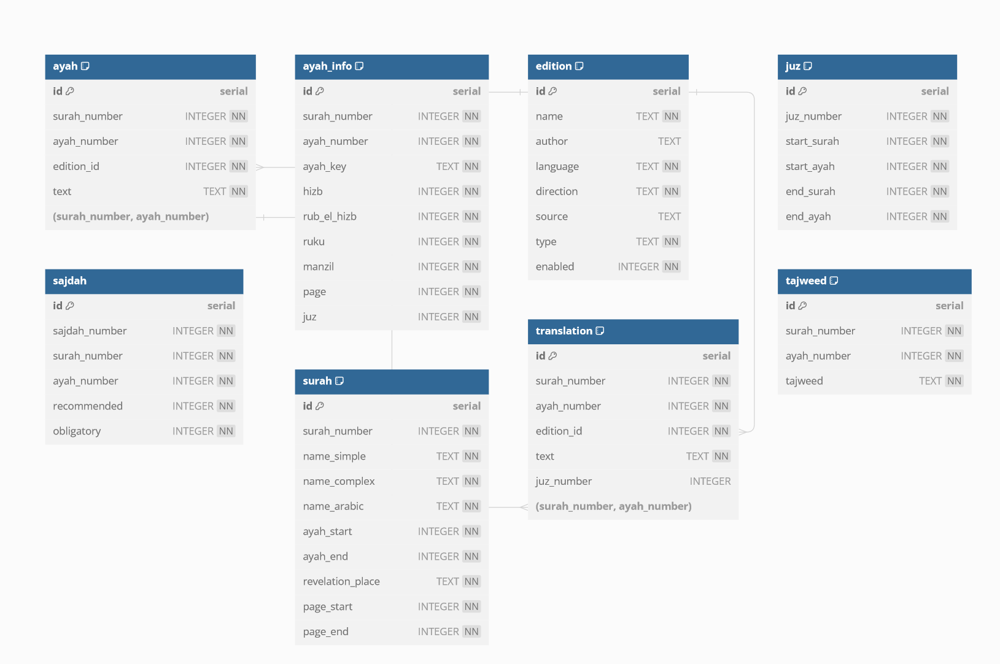

# Quran Data Management CLI

The Quran Data Management CLI is a comprehensive command-line application designed to manage and populate Quran-related data into a database. This includes editions, translations, Juz, Ayah info, Sajdah, Quran text, Tajweed, and Surahs. The application is built using Go and leverages the Cobra library for CLI operations, making it robust and user-friendly.

## Features

- Editions Management: Insert and manage various Quran editions.
- Translations Management: Fetch and insert translation data for specific editions or all available editions.
- Juz Data Management: Download and insert Juz data.
- Ayah Information Management: Fetch and insert detailed Ayah information.
- Sajdah Information Management: Manage and insert Sajdah points within the Quran.
- Quran Text Management: Insert the text of the Quran with options for different recitations.
- Tajweed Rules Management: Manage and insert Tajweed rules.
- Surah Information Management: Insert detailed Surah information.

## Installation

Before you can run the CLI, ensure you have Go installed on your system. Follow these steps to set up the application:

1. Clone the repository:

```
git clone https://github.com/spa5k/quran_data.git
cd quran_data
```

2. Build the application:

```
make build
```
NOTE: The binaries created will have names like quran-linux, quran-macos etc, so change them accordingly.

## Usage

The CLI provides several commands to manage Quran data:

- Run All Tasks Sequentially:
```
./quran all
```
- Manage Editions:
```
./quran editions
```
- Manage Translations:
    
    Fetch and insert translations for a specific edition:
```
./quran translations --edition "Edition Name"
```
- Fetch and insert translations for all editions:
```
./quran translations
```
- Download and Insert Juz Data:
```
./quran juz
```
- Fetch and Insert Ayah Information:
```
./quran ayahinfo
```
- Fetch and Insert Sajdah Information:
```
./quran sajdah
```
- Fetch and Insert Quran Text:
```
./quran qurantext
```
- Fetch and Insert Tajweed Data:
```
./quran tajweed
```
- Fetch and Insert Surahs Data:
```
./quran surahs
```

## Schema -


Currently there is no relation between the tables, but in future we might add relations between the tables.

## Contributing

Contributions to the Quran Data Management CLI are welcome! Please feel free to fork the repository, make changes, and submit pull requests. You can also open issues in the GitHub repository if you find bugs or have feature suggestions.
License

This project is licensed under the Apache License - see the LICENSE file for details.
